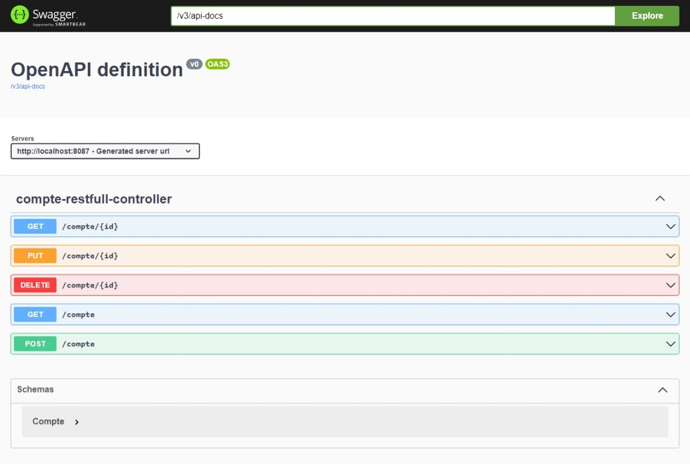
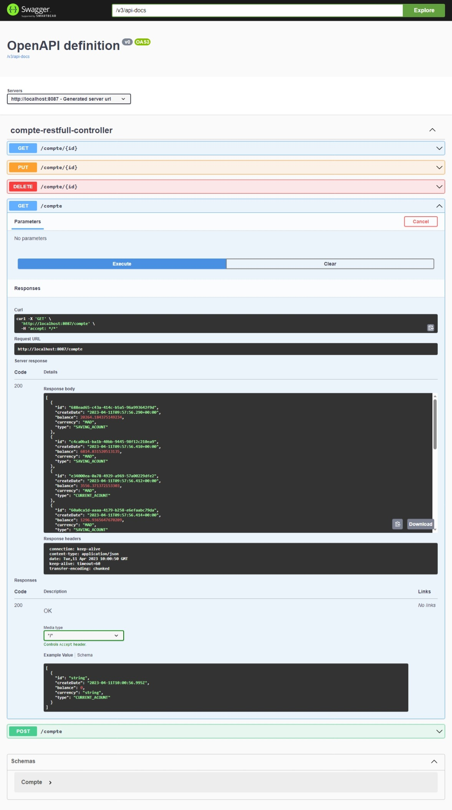
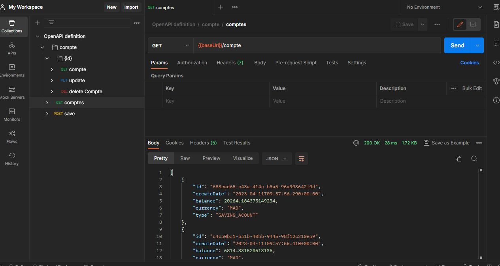
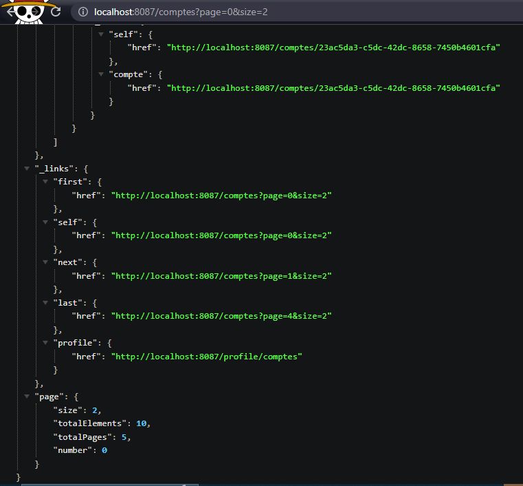
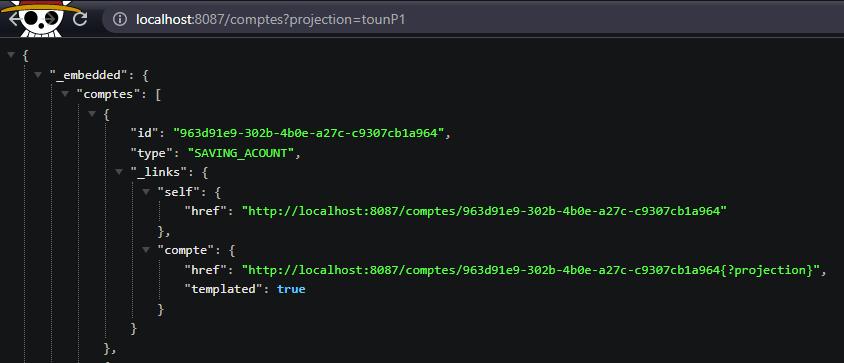

# E-banking Service Application

This is a Spring Boot application that provides a RESTful API for managing bank accounts.
The goal of the assignment is to create a microservice for managing bank accounts using Spring Boot and Spring Data JPA.

## Overview

This project is an E-banking service that allows users to perform various banking operations online. It is built using Java and Spring Boot framework as part of a TP assignment that required the following tasks:

  - Create a Spring Boot project with Web, Spring Data JPA, H2, and Lombok dependencies
  - Create a JPA entity for `Compte`
  - Create a Spring Data repository interface for `Compte`
  - Create a RESTful web service to manage bank accounts
  - Test the DAO layer
  - Test the web microservice using a REST client such as Postman
  - Generate and test Swagger documentation for the REST API of the web service
  - Expose a RESTful API using Spring Data REST, using projections
  - Create DTOs and mappers
  - Create the service layer for the microservice

## Dependencies

- `spring-boot-starter-data-jpa`
- `spring-boot-starter-web`
- `spring-boot-starter-web-services`
- `com.h2database:h2`
- `org.springdoc:springdoc-openapi-ui:1.7.0`
- `org.projectlombok:lombok`
- `spring-boot-starter-data-rest`
- `spring-boot-starter-graphql`

## Entity

```java
@Entity
@Data @AllArgsConstructor @NoArgsConstructor @Builder
public class Compte {
    @Id
    private String id;
    private Date createDate;
    private Double balance;
    private String currency;
    @Enumerated(EnumType.STRING)
    private TypeCompte type;
}
```
## RESTful Web Service

```Java
@RestController
public class CompteRestfullController {
private CompteRepository compteRepository;
    public CompteRestfullController(CompteRepository compteRepository) {
        this.compteRepository = compteRepository;
    }
    @GetMapping("/compte")
    public List<Compte> comptes(){
        return compteRepository.findAll();
    }
    @GetMapping("/compte/{id}")
    public Compte compte(@PathVariable String id){
        return compteRepository.findById(id).orElseThrow(()->new RuntimeException("count not found"));
    }
    @PostMapping("/compte")
    public Compte save(@RequestBody Compte compte){
        compte.setId(UUID.randomUUID().toString());
        return compteRepository.save(compte);
    }
    @PutMapping("/compte/{id}")
    public Compte update( @PathVariable String id,@RequestBody Compte compte){
        Compte compte1 = compteRepository.findById(id).orElseThrow(()->new RuntimeException("not found"));
        if (compte.getBalance()!= null) compte1.setBalance(compte.getBalance());
        if (compte.getCurrency()!= null)compte1.setCurrency(compte.getCurrency());
        if (compte.getCreateDate()!= null)compte1.setCreateDate(compte.getCreateDate());
        if (compte.getType()!= null)compte1.setType(compte.getType());
        return compteRepository.save(compte1);
    }
    @DeleteMapping("/compte/{id}")
    public void deleteCompte(@PathVariable String id){
        compteRepository.deleteById(id);
    }
}
```
## Test using Swagger ui


#



## Test using Postman


## Test Spring Data Rest

```Java
@RepositoryRestResource
public interface CompteRepository extends JpaRepository<Compte,String> {
    @RestResource(path = "/byType")
    List<Compte> findByType(@Param("t")TypeCompte type);
}

```
### Projection 
```Java
@Projection(types = Compte.class , name = "tounP1")
public interface CompteProjection {
    public String getId();
    public TypeCompte getType();
}
```




# Starting Good practices (add DTO and Business layer)

### ResponseDTO
```Java
@Data @AllArgsConstructor @NoArgsConstructor @Builder
public class BankAccountResponseDTO {
    private Double balance;
    private String currency;
    private TypeCompte type;
}
```
### RequestDTO
```Java
@Data @AllArgsConstructor @NoArgsConstructor @Builder
public class BankAccountRequestDTO {
    private String id;
    private Date createDate;
    private Double balance;
    private String currency;
    private TypeCompte type;
}
```
### Mapper
```Java
@Component
public class AccountMapper {
    public BankAccountResponseDTO fromBankAccount(Compte compte) {
        BankAccountResponseDTO bankAccountResponseDTO = new BankAccountResponseDTO();
        BeanUtils.copyProperties(compte, bankAccountResponseDTO);
        return bankAccountResponseDTO;
    }

    public Compte fromRequestDTO(BankAccountRequestDTO bankAccountRequestDTO) {
        Compte compte = new Compte();
        BeanUtils.copyProperties(bankAccountRequestDTO, compte);
        return compte;
    }
}
```
### Service 
- Interface 
```Java
public interface AccountService {
    BankAccountResponseDTO addAccount(BankAccountRequestDTO bankAccountDTO);

    List<BankAccountResponseDTO> findAll();

    BankAccountResponseDTO findById(String id);

    void deleteById(String id);

    BankAccountResponseDTO updateCompte(String id, Compte compte);
}
```
- Implementation
```Java
@Service  @Transactional @AllArgsConstructor
public class AccountServiceImpl implements AccountService {
    private CompteRepository compteRepository;
    private AccountMapper accountMapper;

    @Override
    public BankAccountResponseDTO addAccount(BankAccountRequestDTO bankAccountDTO) {
        Compte savedAcc = compteRepository.save(accountMapper.fromRequestDTO(bankAccountDTO));
        return accountMapper.fromBankAccount(savedAcc);
    }

    @Override
    public List<BankAccountResponseDTO> findAll() {
        return (List<BankAccountResponseDTO>) compteRepository.findAll().stream().map(t -> accountMapper.fromBankAccount(t));
    }

    @Override
    public BankAccountResponseDTO findById(String id) {
        Compte c = compteRepository.findById(id).orElseThrow(() -> new RuntimeException("count not found"));
        return accountMapper.fromBankAccount(c);
    }

    @Override
    public void deleteById(String id) {
        compteRepository.deleteById(id);
    }

    @Override
    public BankAccountResponseDTO updateCompte(String id, Compte compte) {
        Compte compte1 = compteRepository.findById(id).orElseThrow(() -> new RuntimeException("not found"));
        if (compte.getBalance() != null) compte1.setBalance(compte.getBalance());
        if (compte.getCurrency() != null) compte1.setCurrency(compte.getCurrency());
        if (compte.getCreateDate() != null) compte1.setCreateDate(compte.getCreateDate());
        if (compte.getType() != null) compte1.setType(compte.getType());
        return accountMapper.fromBankAccount(compteRepository.save(compte1));
    }
}    
```
## the updated version of our REST CONTROLLER
```Java
@RestController @RequestMapping("/api")  @AllArgsConstructor
public class CompteRestfullController {
    private AccountService accountService;


    @GetMapping("/compte")
    public List<BankAccountResponseDTO> comptes() {
        return accountService.findAll();
    }

    @GetMapping("/compte/{id}")
    public BankAccountResponseDTO compte(@PathVariable String id) {
        return accountService.findById(id);
    }

    @PostMapping("/compte")
    public BankAccountResponseDTO save(@RequestBody BankAccountRequestDTO compte) {
        return accountService.addAccount(compte);
    }

    @PutMapping("/compte/{id}")
    public BankAccountResponseDTO update(@PathVariable String id, @RequestBody Compte compte) {
        return accountService.updateCompte(id, compte);
    }

    @DeleteMapping("/compte/{id}")
    public void deleteCompte(@PathVariable String id) {
        accountService.deleteById(id);
    }
}
```

# GraphQL
### Schema.graphqls
```GraphQL
type Query{
    accountsList : [Compte],
    findAccount(id:String):Compte
}
type Mutation {
    addAccount(compte: BankAccountRequestDTO) : Compte,
    updateAccount(id:String,compte: BankAccountRequestDTO):Compte,
    deleteAccount(id:String):Boolean
}
type Compte{
    id :String,
    createDate : Float,
    balance : Float,
    currency : String,
    type:String
}
input BankAccountRequestDTO{
    balance : Float,
    currency : String,
    type:String
}
```
### Controller
```Java
@Controller @AllArgsConstructor
public class BankServiceControllerGraohql {
    private CompteRepository compteRepository;
    private AccountService accountService;
    private AccountMapper accountMapper;
    @QueryMapping
    public List<Compte> accountsList(){
        return compteRepository.findAll();
    }
    @QueryMapping
    public Compte findAccount(@Argument String id){
        return compteRepository.findById(id).orElseThrow(()->new RuntimeException("account not founds"));
    }
    @MutationMapping
    public BankAccountResponseDTO addAccount(@Argument BankAccountRequestDTO compte){
        return accountService.addAccount(compte);
    }
    @MutationMapping
    public BankAccountResponseDTO updateAccount(@Argument String id,@Argument BankAccountRequestDTO compte){
        return accountService.updateCompte(id,accountMapper.fromRequestDTO(compte));
    }
    @MutationMapping
    public Boolean deleteAccount(@Argument String id){
         accountService.deleteById(id);
         return true;
    }
}
```
### Exception Handler
```Java
@Component
public class ExceptionHandler extends DataFetcherExceptionResolverAdapter {
    @Override
    protected GraphQLError resolveToSingleError(Throwable ex, DataFetchingEnvironment env) {
        return new GraphQLError() {
            @Override
            public String getMessage() {
                return ex.getMessage();
            }
            @Override
            public List<SourceLocation> getLocations() {
                return null;
            }
            @Override
            public ErrorClassification getErrorType() {
                return null;
            }
        };
    }
}

```

### Testing
> find an Account By ID
```GraphQL
query {
  findAccount(id:"abb3e8c4-98a9-4a7b-9207-972b784bcbae"){
  	type,balance,currency
  }
}
```
> find all Accounts
```GraphQL
query{
    accountsList{
        id
    }
}
```
> Add a new Account
```GraphQL
mutation($t:String,$b:Float,$c:String){
    addAccount(compte:{
        balance:$b,
        currency:$c,
        type:$t
    }){
        id,balance,currency,type
    }
}
```
> update an Account 
```GraphQL
mutation($id:String,$t:String,$b:Float,$c:String){
    updateAccount(
        id:$id,
        compte:{
            balance:$b,
            currency:$c,
            type:$t
        })
        {
            id,balance,currency,type
        }
}
```
> delete an Account
```GraphQL
mutation($id:String){
    deleteAccount(
        id:$id
    )
}
```

# Author
<a href="https://abbo.vercel.app/">Abderrahmane ETTOUNANI</a>